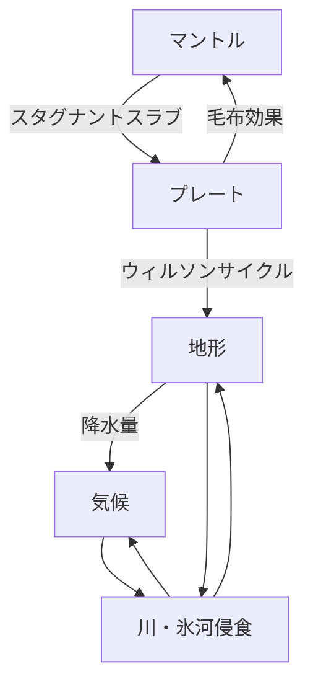

# Architecture

## データモデル

球面上の各頂点を 1 セルとみなし、幾何情報、近傍トポロジ、状態量を保持する。
状態量には標高、温度、湿度、プレートID、人口、国家ID、河川流量、河川の流下先を含む。

## モジュール



全体の流れは、メッシュ生成の後に、地形・気候・生態・文明の各計算系を並列に更新しながら進む。
双方向にループしている場所は、同一tickで解く感じ。1tickが短い時には、加重平均をたすという対応。
ここでいう各「○○期」は、排他的に切り替わる不可逆フェーズではなく、その時代にどの計算系を重視するかを表す名前として扱う。


### 期一覧（たたき台）

以下の「期」は、サブシステムの開始・停止境界ではない。
各期では、更新比率、内部更新回数、観測する時間幅を変える。

期の役割は**注目したい現象が最も見えやすい時間スケールで世界を動かす**ことだ。
各期の自動遷移は、活動量の収束ではなく、その期に形成されるべき構造が十分に出来上がったかで判定する。

#### 地殻形成期

- 主な計算対象: プレート、地殻、造山、海陸骨格
- 1 Tick の意味: 500万年
- 重視する更新: プレート・地形を最優先。気候/生態/文明は低頻度または停止
- 状態判定の目安: 未定

#### 環境形成期

- 主な計算対象: 侵食、堆積、気候（大気・降水）、水循環、河川網
- 1 Tick の意味: 1万年
- 重視する更新: 河川・侵食・気候を最優先。地形は継続更新、生態は低頻度で試行可能
- 状態判定の目安（案）: 河川流量・堆積量・気候場の総変化率が一定期間小さい

#### 生命誕生期

- 主な計算対象: 植生、土壌、生態系、一次生産域
- 1 Tick の意味: 1000年
- 重視する更新: 生態を最優先。河川・気候は継続、文明は条件付きで発芽
- 状態判定の目安（案）: 植生指数と生態ネットワーク指標の総変化量が一定期間小さい

#### 文明成立期

- 主な計算対象: 定住、集落、都市化の初期段階、交易の芽、社会構造
- 1 Tick の意味: 100年
- 重視する更新: 文明・生態・気候の相互作用。河川侵食は低頻度継続
- 状態判定の目安（案）: 人口・都市数・交易路が安定的に増加し始める

#### 歴史展開期

- 主な計算対象: 国家、都市、文化、人口、技術、外交、戦争
- 1 Tick の意味: 1年
- 重視する更新: 文明を最優先。地形/河川/気候/生態も低頻度またはイベント駆動で継続
- 終了条件: なし（通常シミュレーションの継続時代）

### 期の関係（直列遷移ではなく並列進行）

各計算系は相互依存しており、特定の期になったから他の計算系が止まるわけではない。
ただし依存の向きには強弱がある。

- 地形は気候・生態・文明の基盤を与える
  - `height`
  - `plate_id`
  - 地殻特性
  - 海陸境界
  - 河川・堆積地形
- 気候は河川・生態・文明へ影響する
  - 気温
  - 降水
  - 風系（将来）
- 河川は気候に影響を及ぼす
- 河川・環境は生態・文明へ影響する
  - `river_flux`, `river_next`
  - 土壌/堆積指標
  - 洪水リスク（将来）
- 生態は文明へ資源制約を与える
  - 生態資源分布
  - 可住性
  - 食糧生産力
- 文明は環境へ逆作用しうる（将来）
  - 灌漑
  - 森林伐採
  - 治水
  - 土地利用変化

### Tick と内部更新の考え方

各期に書かれている 1 Tick は、世界時間の管理単位である。
これは、各計算の数値更新ステップ幅をそのまま意味しない。

例えば、環境形成期では 1 Tick = 1万年として扱うが、河川侵食や堆積はそれより細かい内部更新を複数回実行してよい。
同様に、歴史展開期でも河川や気候は低頻度に継続更新できる。

ここでいう「サブシステム」とは、世界全体の中の個別の計算系を指す。
例として、地形、河川、気候、生態、文明がある。

各サブシステムは、期のTickとは別に内部更新粒度を持てる。

- 河川・侵食・堆積: 細かく更新
- 気候: 数十〜数百年相当のまとまりで更新（将来仕様）
- 生態: 生態遷移に合わせた中間粒度で更新（将来仕様）
- 文明: 年単位またはイベント駆動で更新（将来仕様）

この分離により、河川のように狭いスケールで起こる現象を、長い期Tickの中でも自然に表現できる。

### 時代スケール制御

- 現在の時代名（地殻形成期など）は保持する
- ただし時代名は排他的なモードではなく、更新比率のプリセットとして扱う
- 各サブシステムに対して、実行回数・時間幅・計算予算を配る

#### 自動遷移の考え方

期の切り替えは自動で行われる。遷移のトリガーは、現在の期で形成されるべき構造が十分に出来上がったかの判定による。判定は各期ごとに異なる対象を見る（「遷移判定の目安」参照）。
判定の精度より「だいたい自然なタイミングで切り替わる」ことを優先し、閾値はseedに依存しにくい形で設計する。

遷移は緩やかな重みの移行として行われる。

例:
- 地殻形成期から環境形成期へ移るときも、地形更新を 100% から 30% に落とすだけで、0%にはしない
- 環境形成期から生命誕生期へ移るときは、生態更新を増やしつつ、河川・気候は継続する

### 地形の非回帰ポリシー（現行実装）

現行実装では、進行中の地形を初期プレート基準標高へ自動で引き戻す処理を持たない。
地形の時間変化は、地形サブシステムの増分更新と河川侵食オートマトンの両方で発生する。
したがって、長時間進行しても「初期地形へ戻る」挙動は仕様上発生しない。

### 世界ツリー
介入によって世界は分岐し、ツリー構造を持つ。
seed
└── 本線 tick0〜
    ├── 分岐A（tick300で介入）
    │   └── tick300〜
    └── 分岐B（tick400で介入）
        └── tick400〜
各ブランチは分岐点以前のデータを親ノードへの参照として持つ。
分岐点より前のスナップショットは親と共有されるため、ストレージを節約できる。

### 書き出し形式

全tickのセル状態をキーフレーム＋差分で保存する。

- 一定間隔でフルスナップショット（キーフレーム）を保存する
- キーフレーム間は差分のみ保存する
- 巻き戻しは直近のキーフレームから再生して目的のtickへ到達する
- 地殻形成期など1Tick=500万年の時代はキーフレーム間隔を粗くし、歴史展開期は密にする

軽くするために、型は最小限のものを使うようにする。


### 介入
神が介入できるように。

```text
transaction_id : 操作の束を識別
tick           : 世界時間
cell_id        : 対象セル
field          : 変更した状態量
before         : 変更前の値
after          : 変更後の値
```

### 現在の実装状況

#### 実装済み

- メッシュ生成（icosphere + 近傍CSR）
- プレート地形生成（`docs/core/plate.md`）
- プレート重心ドリフトに基づくプレート再割当（簡易プレート移動）
- 河川・侵食・堆積の基礎実装（同期版）
- 河川侵食の非同期オートマトン試作

#### 実装中 / 仕様未確定

- 気候（降水計算は地形生成に一部内包。独立仕様は未整備）
- 環境形成期の収束判定

#### 未実装

- 生命誕生期の生態系仕様
- 文明成立期の社会形成仕様
- 歴史展開期の国家・技術・外交仕様

## MESH生成仕様

- 基本形状は正二十面体
- 再帰分割レベルはL=6を中心に運用
- 頂点は単位球面へ正規化
- 描画は三角形インデックスを利用

## 地形生成

地形生成は、場の生成、プレート分割、境界補正、平滑化、海面再調整、河川計算の順で進む。
詳細仕様は`docs/core/plate.md`を参照。

## 描画ポリシー

海面下の地形値は計算結果として保持するが、現行の描画では海面下の頂点変位を反映しない。
海で亀裂のように見えるアーティファクトを避けるため、地形変位は陸地のみへ適用する。

## 関連ドキュメント
`docs/manage/test.md` 具体的な機能の流れのメモ

## 設定
地形生成: config/terrain.yaml
ランタイム制御（活動量観測・収束判定の調整）: config/runtime.yaml
