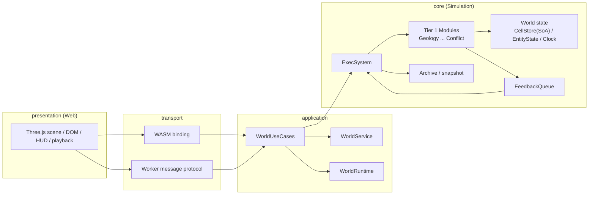

# Architecture

本書では設計思想と全体構成を説明する。API や型定義の正本は `docs/reference/` 配下を参照する。

## 設計思想

歴史シミュレータの設計軸は、「何を扱うか」ではなく「状態の変化速度」とする。

遅いものは速いものの条件を決める。
速いものは遅いものを少しずつ侵食する。
この非対称な双方向関係を、個別の特例ロジックではなく、コード構造そのものに埋め込む。

この方針により、文明が環境を破壊して自滅する、気候変動が国家を崩す、といった現象を自然に表現する。

## 全体構成

実装基盤として、セル向けSoAと疎なEntity向け専用ストアの分離を採用する。

### システム全体像



依存方向は `presentation -> transport -> application -> core` とし、詳細は `docs/concepts/runtime_layers.md` を参照する。

### Simulation内部構成

```text
Simulation
├── CellStore         （全セルのComponent群、SoA配列）
├── EntityState       （Polity・Settlement・Region等の疎なEntity）
├── polity_relations  （国家間の二者間関係）
├── polity_groups     （経済圏・軍事同盟・文化宗教圏などのグループ）
├── clock             （tick・epoch・予算）
├── feedback          （FeedbackQueue）
└── archive           （履歴・スナップショット）
```

### 用語定義

- `Model`
    - 1つの計算式・関数。最小の計算単位。
- `System`
    - 更新を司る実行単位。1つ以上の `Model` を適用し、必要に応じて構成を切り替える。
- `Module`
    - 同一、または非常に近い内容を読み書きする `System` を束ねた便宜的な単位。
    - `Module` はECSの都合とは独立した設計上の区分である。
- `ExecSystem`
    - tick進行、予算配分、時代遷移、履歴、`FeedbackQueue` の一括適用、および実行対象 `System` の切り替えを担当する。

### Tier 1 Module一覧（更新順）

```text
ExecSystem（切り替えと実行制御）
├── GeologyModule
├── ClimateModule
├── GlaciologyModule
├── HydrologyModule
├── EcologyModule
├── DomesticatesModule
├── SubsistenceModule
├── PopulationModule
├── SettlementModule
├── PolityModule
└── ConflictModule
```

各 `Module` の内部で、時代や状態に応じて1つ以上の `System` を選択して実行する。

---

## SoA + EntityState の採用

### 採用理由

このシミュレータの処理の本質は「全セル（約4万）に対して、同じ計算を一斉に適用する」ことである。
セル状態にはSoAが適合し、CPUキャッシュ効率を最大化できる。

また、Tier2モジュール追加時に `Module` と必要な `System`・Componentを登録するだけで拡張できるため、
複雑性の増加に対してアーキテクチャが崩れにくい。

### セルと非セルEntityの分離

セルと非セルEntityでは性質が異なるため、管理方法を分ける。

- `CellStore`（自前SoA）
    - 全セルの現在値Componentを保持する
- `EntityState`（疎なEntity）
    - `slotmap` ベースで Polity・Settlement・Region などを保持する
- `polity_relations`（国家間関係）
    - 国家間の重み付き関係を保持する

データ配置と型定義の詳細は `docs/reference/architecture/data_model.md` を参照。

---

## Systemの原則

`System` は「更新を行う実行単位」として実装する。
`CellStore`・`EntityState`・`Clock`・`FeedbackQueue`（必要に応じて`Archive`）を入力に、次状態を書き戻す。

`System` 内部は複数 `Model` で構成してよい。
ただし、対象 `Model` の構成自体が変わる場合（例: 川の侵食表現を時間段階で切り替える場合）は、
別 `System` への分割を行う。

同一tick内の依存はDAGで順序を保証し、逆方向の影響はFeedbackQueueで次tickへ遅延させる。
更新順序と時代制御の詳細は `docs/concepts/phase_control.md` を参照。

各Systemの読み書き境界（Read/Write/Do-not-write）は `docs/reference/architecture/module_boundaries.md` を参照。

---

## 関連文書

- 実行時レイヤ（presentation / transport / application / core）
    - `docs/concepts/runtime_layers.md`
- 時代・tick・予算・遷移
    - `docs/concepts/phase_control.md`
- CellStore・EntityState・Clock・FeedbackQueue・Archiveの構造と型定義
    - `docs/reference/architecture/data_model.md`
- 各Systemが何を読み、何を書くか
    - `docs/reference/architecture/module_boundaries.md`
